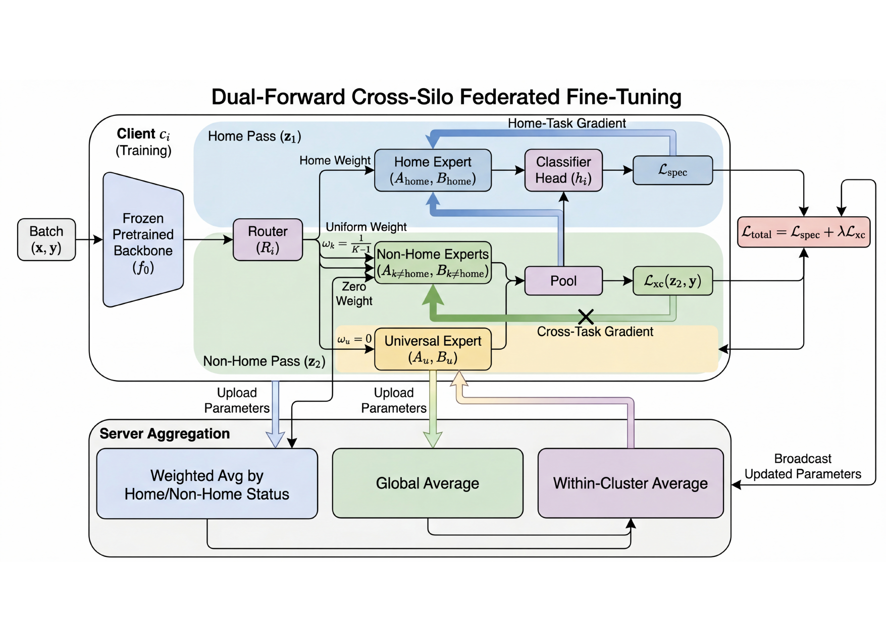

# Dual-Forward Federated LoRA-MoE

A federated LoRA mixture-of-experts framework with **asymmetric dual-forward
training**, designed for cross-silo deployments in which the task identity of
each request is fixed at the gateway and every client performs inference using
**only its locally stored home-cluster LoRA expert**.

The core idea: on every batch the trainer runs two structurally different
forward passes — one that activates only the home-cluster expert, and one that
deactivates it and uniformly pools the remaining experts — and combines them in
a single backward step. This isolates the home-task gradient to the home expert
while still teaching the other experts to generalize across tasks.

> Course project for **Distributed Deep Learning Systems (DDLS)**, University of
> Bern. Authors: **Hao Wang** and **Guodong Ma**.



*At each client, the dual-forward pass (home + non-home) feeds the combined
objective `L_total = L_spec + λ·L_xc`; the matching server step aggregates the
home/non-home experts, the universal expert, and the within-cluster average.*

## Highlights

- **Two forward passes, one backward step.** The home-task gradient is routed
  exclusively into the home-cluster expert; the cross-task gradient flows
  through the non-home experts and the shared classifier head.
- **Asymmetric server aggregation** that mirrors the client-side pooling rule
  (weight `1` for home clients, `1/(K−1)` for non-home clients).
- **Home-cluster-only inference**, with the local classifier swapped for the
  target task's cluster classifier at evaluation time.
- **Frozen RoBERTa-Large backbone**, LoRA rank `4` on every query/value
  projection.

### Headline numbers

Five-task federated GLUE benchmark (SST-2 / QNLI / MRPC / QQP / RTE),
RoBERTa-Large, 15 clients, 3 seeds:

| Metric                          | Baseline (FedAvg-LoRA) | Ours (dual-forward) | Δ          |
| ------------------------------- | ---------------------: | ------------------: | ---------- |
| In-distribution accuracy (mean) |                  86.71 |               86.25 | −0.46      |
| Cross-target accuracy (mean)    |                  63.31 |           **74.49** | **+11.18** |

The dual-forward objective trades a negligible in-distribution drop (−0.46) for
a large cross-target gain (+11.18). As an upstream sanity check, the same code
reproduces the original FedLEASE four-task GLUE result at 87.88 average over
five seeds, matching the 87.76 reported by upstream FedLEASE within seed noise.

## Table of Contents

- [Installation](#installation)
- [Quick Start](#quick-start)
- [Project Structure](#project-structure)
- [Method](#method)
- [Reproducing the Main Results](#reproducing-the-main-results)
- [Post-hoc Evaluation](#post-hoc-evaluation)
- [Aggregating Multi-Seed Results](#aggregating-multi-seed-results)
- [CLI Reference](#cli-reference)
- [Output Files](#output-files)
- [Authors](#authors)
- [License](#license)

---

## Installation

Python 3.11+ and a CUDA-enabled GPU are required. CPU execution is not
supported — RoBERTa-Large forward/backward dominates the runtime.

> **Run every command from the repository root** so that the in-tree `peft/`
> package is imported, not the public PEFT package on PyPI.

### Option A — `uv` (recommended)

```bash
uv sync --no-group slab
```

`uv` reads `pyproject.toml` and `uv.lock`, creates `.venv/` automatically, and
installs every dependency at the locked version.

> **Why `--no-group slab`?** The project defines an optional `slab` dependency
> group that installs `slurmlab` from a sibling `../SlurmLab` checkout used for
> the authors' cluster runs. It is enabled by default in `pyproject.toml`, so a
> plain `uv sync` fails unless that local path exists. `--no-group slab` skips
> it; nothing in the training or evaluation pipeline depends on it.

### Option B — `pip` with a standard virtual environment

```bash
python -m venv .venv
source .venv/bin/activate
python -m pip install --upgrade pip
python -m pip install -r requirements.txt
```

---

## Quick Start

A ~3-minute smoke check on any CUDA GPU, using the small backbone and a tiny
sample budget, confirms the environment is wired up correctly:

```bash
uv run python -u main.py \
  --model_name roberta-base \
  --tasks sst2 qnli \
  --global_rounds 2 --warmup_rounds 1 \
  --train_samples 64 --test_samples 32 --batch_size 16 \
  --max_clusters 2 \
  --output_dir ./output/smoke
```

Once the smoke check passes, see [Reproducing the Main
Results](#reproducing-the-main-results) for the full RoBERTa-Large runs that
produce the headline numbers.

---

## Project Structure

```text
.
├── main.py                    # Training entry point + CLI; federated outer loop
├── client.py                  # Local client training; the dual-forward trainer
├── server.py                  # Federated aggregation incl. asymmetric cluster rule
├── utils.py                   # Dataset loading, GLUE preprocessing, helpers
├── pyproject.toml             # uv project metadata and pinned deps
├── requirements.txt           # pip fallback requirement list
├── uv.lock                    # Fully resolved dependency lock
├── LICENSE
├── README.md
│
├── peft/                      # In-tree fork of HuggingFace PEFT
│   ├── tuners/                #   LoRA, AdaLoRA, MMoE-LoRA, prefix tuning, ...
│   ├── utils/                 #   Config, save/load, adapter helpers
│   ├── peft_model.py          #   PeftModel wrapper
│   ├── mapping.py             #   Adapter-type registry
│   └── ...                    #   Do not replace with the public `peft` package
│
└── scripts/
    ├── repro/                 # Multi-seed training wrappers
    │   ├── run_all_seeds.sh   #   Five-seed 4-task FedLEASE baseline (lr=1e-3)
    │   ├── run_wos_main.sh    #   Six-task shuffled-pooling variant
    │   └── sweep_lr.sh        #   Learning-rate sweep for the 4-task baseline
    │
    ├── eval/                  # Post-hoc checkpoint evaluation pipelines
    │   ├── head_swap_eval.py          # Local vs cluster classifier at inference
    │   ├── head_portability_matrix.py # 4 classifier-construction protocols
    │   ├── expert_merge_eval.py       # Average all cluster experts into one adapter
    │   └── cold_start_reuse.py        # New-client cold-start expert reuse
    │
    ├── verify/                # Standalone implementation-invariant checks
    │   ├── verify_write_only_soft.py  # Home expert receives no non-home gradient
    │   ├── verify_soft_zero_equiv.py  # visa_coeff=0 reproduces vanilla baseline
    │   ├── verify_learned_affinity.py # Learned affinity routing equivalences
    │   └── verify_conflict_clip.py    # Server-side conflict-clip aggregation
    │
    └── analysis/              # Result aggregation and figure generation
        ├── analyze_results.py        # Multi-seed metric aggregation
        ├── run_alpha_sweep.py        # Sweep over the `λ` (visa_coeff) grid
        ├── metadata_bit_curve.py     # Post-hoc mutual-information analysis
        ├── make_paper_figures.py     # Publication-style main composite figure
        └── make_report_figures.py    # Additional figures (Pareto, heatmap, dumbbell)
```

### Where the method lives

- The two forward passes are implemented in `client.py` inside the local-step
  routine. The home pass forces a one-hot router; the non-home pass uses
  uniform pooling over the `K−1` non-home cluster experts.
- The asymmetric server-side aggregation rule (weight `1` for home, `1/(K−1)`
  for non-home) is in `server.py`.
- All CLI flags, the federated outer loop, the warm-up schedule, and the
  cross-evaluation harness live in `main.py`.

The in-tree `peft/` directory is a frozen fork required by the federated
trainer. **Do not** replace it with the public `peft` package on PyPI.

---

## Method

### Notation

- `N` clients partitioned into `K` clusters; each cluster owns one downstream
  task.
- `home(i) ∈ {1, ..., K}` is the cluster index of client `c_i`.
- Each client holds `K` cluster LoRA experts `{(A_k, B_k)}`, one universal
  LoRA expert `(A_u, B_u)`, a router `R_i`, and a local classifier `h_i`.
- Router weights `ω = (ω_1, ..., ω_K, ω_u)` mix the experts inside each
  LoRA-augmented projection.

### Dual-forward objective

On each batch `(x, y)` at client `c_i`, two forward passes feed one combined
loss:

```
Home pass:     z_1 = f(x; ω_home(i)=1, ω_k=0 for k≠home(i), ω_u=0)
               L_spec = CE(z_1, y)

Non-home pass: z_2 = f(x; ω_home(i)=0, ω_k=1/(K−1) for k≠home(i), ω_u=0)
               L_xc = CE(z_2, y)

Total loss:    L_total = L_spec + λ · L_xc            (λ = 0.20)
```

A single backward step on `L_total` routes gradients asymmetrically:

- Home expert ← `L_spec` only.
- Each non-home expert ← `L_xc` only.
- Classifier head ← both passes.
- Universal expert ← zero local gradient; updated through server aggregation.

### Asymmetric server aggregation

For each cluster `k`, the server-side weighted average gives every client a
contribution weight that depends on whether `k` is its home cluster:

```
μ_c^(k) = 1            if home(c) = k
        = 1/(K−1)      otherwise

(A_k, B_k) ← Σ_c (μ_c^(k) / Σ_c' μ_c'^(k)) · (A_k, B_k)^(c)
```

The within-cluster term recovers standard cluster-internal FedAvg; the
cross-cluster term matches the uniform pooling used on the client side.

### Inference protocol

At inference the router is overridden to the one-hot home configuration, the
universal expert is deactivated, and the local classifier `h_i` is replaced by
the cluster classifier `\bar h_{home(j)}` of the target task `T_j`, which the
gateway provides given the known task identity.

### Design summary

| Component                | Design                                                                              |
| ------------------------ | ----------------------------------------------------------------------------------- |
| Gradient routing         | Two forward passes, one backward; home-task gradient is isolated to the home expert |
| Pooling on non-home pass | Fixed uniform pooling, weight `1/(K−1)` per non-home cluster                         |
| Server aggregation       | Asymmetric weights mirror the client-side pooling rule                              |
| Inference protocol       | Home-cluster-only routing + cluster-averaged target classifier                      |
| Backbone                 | RoBERTa-Large (frozen), LoRA rank `4` on every query / value projection             |

---

## Reproducing the Main Results

Each block below is ≈ 3 GPU-hours total across the listed seeds.

### 1) Four-task FedLEASE baseline

Reproduces the upstream FedLEASE in-distribution result on 4-task GLUE.

```bash
python -u main.py \
  --model_name roberta-large \
  --tasks sst2 sst2 sst2 sst2 qnli qnli qnli qnli mrpc mrpc mrpc mrpc qqp qqp qqp qqp \
  --global_rounds 25 --warmup_rounds 5 --local_epochs 2 \
  --assignment_mode oracle --rank 4 --max_clusters 4 --lr 1e-3 \
  --batch_size 128 --train_samples 1000 --test_samples 200 \
  --save_final_params --cross_eval \
  --seed 42 \
  --output_dir ./output/fedlease_4task_seed42
```

A five-seed wrapper (seeds 42, 43, 44, 45, 46) is provided at
`scripts/repro/run_all_seeds.sh`. Activate your Python environment first
(`source .venv/bin/activate`), then run the wrapper.

Expected result: **87.88** average accuracy across the five seeds.

### 2) Five-task dual-forward headline result

```bash
python -u main.py \
  --model_name roberta-large \
  --tasks sst2 sst2 sst2 qnli qnli qnli mrpc mrpc mrpc qqp qqp qqp rte rte rte \
  --global_rounds 25 --warmup_rounds 5 --local_epochs 2 \
  --assignment_mode oracle --rank 4 --max_clusters 5 --lr 1e-3 \
  --batch_size 64 --train_samples 1000 --test_samples 200 \
  --universal_expert --additive_residual --universal_warmup_rounds 5 \
  --soft_membership task_family --visa_coeff 0.20 \
  --client_exposure_mode uniform_nonhome --server_exposure_mode uniform_nonhome \
  --save_final_params --cross_eval \
  --seed 42 \
  --output_dir ./output/dualforward_5task_seed42
```

Repeat with `--seed 43` and `--seed 44` to reach the headline **74.49**
cross-target mean.

### 3) Pooling-rule ablation

Re-run the five-task command with both `*_exposure_mode` flags replaced. The
valid pooling modes are:

| Mode               | Pooling rule                                                              |
| ------------------ | ------------------------------------------------------------------------- |
| `uniform_nonhome`  | Uniform `1/(K−1)` over the non-home cluster experts (main result)         |
| `learned`          | Softmax over learned cosine-similarity affinities                         |
| `shuffled`         | Fixed derangement of the learned weights (breaks the cluster identity)    |

To run a single side at a time, set the other side to `uniform_nonhome` (or
disable the non-home pass with `--visa_coeff 0.0`).

---

## Post-hoc Evaluation

Every script below reads the `final_params.pt` produced by Section 1 / 2 and
writes a single JSON file. Re-training is not required.

```bash
# Cluster classifier vs local classifier under home-cluster-only routing
python -u scripts/eval/head_swap_eval.py \
  --checkpoint-dir ./output/dualforward_5task_seed42 \
  --force-eval-mode home_cluster_only \
  --head-source cluster_average \
  --output ./output/head_swap_seed42.json

# Robustness across four classifier-construction protocols
# (cluster-average / individual mean / worst individual / leave-one-out)
python -u scripts/eval/head_portability_matrix.py \
  --checkpoint-dir ./output/dualforward_5task_seed42 \
  --output ./output/head_portability_seed42.json

# Post-hoc averaging of cluster experts into a single router-free adapter
python -u scripts/eval/expert_merge_eval.py \
  --checkpoint-dir ./output/dualforward_5task_seed42 \
  --output ./output/expert_merge_seed42.json

# Cold-start reuse of trained experts on a new client
python -u scripts/eval/cold_start_reuse.py \
  --checkpoint-dir ./output/dualforward_5task_seed42 \
  --output ./output/cold_start_seed42.json
```

Run each script for every seed and average the JSON fields to obtain the
ablation numbers.

---

## Aggregating Multi-Seed Results

After several training seeds complete, aggregate per-seed and mean metrics:

```bash
python scripts/analysis/analyze_results.py \
  --output_dir ./output \
  --seeds 42 43 44
```

Use `--seeds 42 43 44 45 46` for the five-seed 4-task baseline reproduction.

---

## CLI Reference

The most relevant flags accepted by `main.py`. The full list is available via
`python main.py --help`.

| CLI flag                                          | Purpose                                                                         |
| ------------------------------------------------- | ------------------------------------------------------------------------------- |
| `--model_name`                                    | HuggingFace backbone (`roberta-large` for reported numbers, `roberta-base` for smoke) |
| `--tasks`                                         | Whitespace-separated list of GLUE tasks, one per client                         |
| `--max_clusters`                                  | Number of clusters `K`                                                          |
| `--assignment_mode {oracle, learned}`             | How clients are assigned to clusters; reported numbers use `oracle`             |
| `--rank`                                          | LoRA rank `r`                                                                   |
| `--global_rounds`                                 | Total communication rounds                                                      |
| `--warmup_rounds`                                 | LoRA warm-up rounds before the dual-forward objective is enabled                |
| `--universal_warmup_rounds`                       | Warm-up rounds for the universal expert                                         |
| `--local_epochs`                                  | Local epochs per round                                                          |
| `--batch_size`                                    | Per-client batch size                                                           |
| `--lr`                                            | AdamW learning rate                                                             |
| `--train_samples`, `--test_samples`               | Per-client sample budgets                                                       |
| `--universal_expert --additive_residual`          | Enables the universal LoRA expert with additive-residual composition            |
| `--soft_membership task_family`                   | Task-family routing on top of the universal expert                              |
| `--visa_coeff`                                    | Cross-task loss coefficient `λ` (set to `0.20` for the reported numbers)        |
| `--client_exposure_mode {uniform_nonhome,learned,shuffled}` | Client-side pooling rule for the non-home pass                        |
| `--server_exposure_mode {uniform_nonhome,learned,shuffled}` | Server-side aggregation rule                                          |
| `--cross_eval`                                    | Enable cross-task evaluation at the end of training                             |
| `--save_final_params`                             | Save `final_params.pt` for use by `scripts/eval/*`                              |
| `--seed`                                          | Random seed                                                                     |
| `--output_dir`                                    | Where artifacts are written (created if missing)                                |

---

## Output Files

Every training run writes the following into `--output_dir`:

| Path                                | Contents                                                              |
| ----------------------------------- | --------------------------------------------------------------------- |
| `proposed_m2/training_history.json` | Round-level metrics and final per-task accuracies                     |
| `cross_eval_results.json`           | Cross-task evaluation matrix (written when `--cross_eval` is set)     |
| `final_params.pt`                   | Final aggregated model parameters; required input for `scripts/eval/*`|
| `checkpoints/`                      | Periodic training checkpoints used by the resume path                 |
| `soft_membership.json`              | Saved soft-membership weights for the universal expert                |

Each post-hoc evaluation script under `scripts/eval/` writes a single JSON file
whose schema matches the ablation it implements.

---

## Authors

Developed as a course project for **Distributed Deep Learning Systems (DDLS)**
at the **University of Bern**:

- **Hao Wang**
- **Guodong Ma**

---

## License

The top-level `LICENSE` is inherited from upstream FedLEASE (MIT). New
contributions in this repository — the dual-forward objective, the asymmetric
server aggregation rule, and the post-hoc evaluation pipelines — are released
under the same terms.
